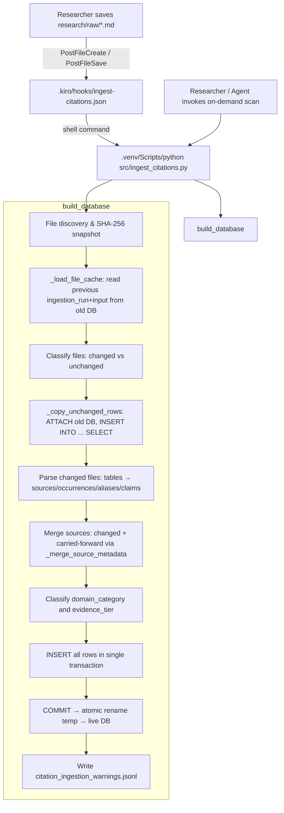

# Design Document: auto-citation-extraction

## Overview

This feature adds two complementary delivery paths to keep `data/citations.duckdb` continuously up to date:

1. **Hook-based auto-trigger** — Kiro `PostFileCreate` and `PostFileSave` hooks fire whenever a `.md` file is written under `research/raw/`, synchronously invoking `build_database` via a shell command.
2. **On-demand full-corpus scan** — the existing `build_database` CLI entry point, invoked manually or by an agent after bulk imports.

Three additional capabilities are implemented entirely inside `src/ingest_citations.py` and `schemas/citations.sql`:

- **Incremental file cache** (Requirement 9) — unchanged files are carried forward from the previous database rather than re-parsed, making hook-triggered builds fast.
- **Domain category classifier** (Requirement 10) — every `source` row receives a `domain_category` label drawn from a closed eight-value enumeration.
- **Evidence tier classifier** (Requirement 10) — every `citation_occurrence` row receives an `evidence_tier` label drawn from a closed four-value enumeration.

No new external dependencies are introduced. All new logic composes with the existing `stable_id()`, `_merge_source_metadata()`, and atomic temp-file rename pattern.

---

## Architecture



The hook fires synchronously; it waits for the Python process exit code before completing. Non-zero exit codes surface the pipeline's full stderr to the Kiro session. The on-demand path is identical except it is user-initiated and has no file-path filter.

---

## Components and Interfaces

### Hook file: `.kiro/hooks/ingest-citations.json`

A single JSON file with two hook entries — one for `PostFileSave` and one for `PostFileCreate`. Both use the same matcher and command.

```json
{
  "version": "v1",
  "hooks": [
    {
      "name": "Auto-ingest citations",
      "trigger": "PostFileSave",
      "matcher": "research/raw/.*\\.md",
      "action": {
        "type": "command",
        "command": ".venv/Scripts/python src/ingest_citations.py --raw-dir research/raw --database data/citations.duckdb --warnings data/citation_ingestion_warnings.jsonl --schema schemas/citations.sql"
      }
    },
    {
      "name": "Auto-ingest citations (new file)",
      "trigger": "PostFileCreate",
      "matcher": "research/raw/.*\\.md",
      "action": {
        "type": "command",
        "command": ".venv/Scripts/python src/ingest_citations.py --raw-dir research/raw --database data/citations.duckdb --warnings data/citation_ingestion_warnings.jsonl --schema schemas/citations.sql"
      }
    }
  ]
}
```

Key constraints:
- `matcher` restricts firing to `research/raw/.*\.md` — paths outside this tree do not trigger extraction.
- `command` uses `.venv/Scripts/python` (Windows path); no hard-coded absolute paths are used.
- The file must not appear in `.gitignore` so it is version-controlled and reproducible.

### `_load_file_cache(database_path: Path) -> dict[str, str]`

Reads the previous run's file snapshot from an existing database using `ATTACH ... AS prev (READ_ONLY)`. Returns `{workspace_relative_path: sha256}` for every `ingestion_input` row in the most recent `ingestion_run`.

```python
def _load_file_cache(database_path: Path) -> dict[str, str]:
    """Return {path: sha256} from the most recent ingestion_run in database_path.

    Returns an empty dict if the database does not exist, cannot be opened,
    or contains no ingestion_run rows.
    """
```

If any exception is raised (file absent, schema mismatch, corrupt DB), the function catches it and returns `{}`, triggering a full rebuild gracefully.

The query uses a subquery to identify the most recent run:

```sql
SELECT ii.path, ii.sha256
FROM ingestion_input ii
JOIN ingestion_run ir ON ir.run_id = ii.run_id
WHERE ir.built_at = (SELECT MAX(built_at) FROM ingestion_run)
```

### `_copy_unchanged_rows(conn, old_db_path, unchanged_paths, run_id, warnings)`

ATTACHes the previous database read-only to the current temporary connection and bulk-copies rows for all unchanged files. Uses `INSERT INTO ... SELECT` for each table rather than row-by-row Python iteration.

Tables copied in dependency order:
1. `research_document` (no FK dependencies on other copied tables)
2. `source` (may be shared across documents — handled separately via merge)
3. `citation_occurrence`
4. `source_alias`
5. `claim`
6. `claim_source`
7. `ingestion_warning` (from previous run, for unchanged file paths)

Sources require special handling: since a source may appear in both a carried-forward file and a changed file (same `source_id`), they are not inserted directly. Instead they are collected into the `source_records` dict and processed through `_merge_source_metadata` alongside sources parsed from changed files. All other tables are inserted directly via `INSERT OR IGNORE` (DuckDB: `INSERT INTO ... SELECT` with conflict handling on the primary key).

Signature:

```python
def _copy_unchanged_rows(
    connection: duckdb.DuckDBPyConnection,
    old_db_path: Path,
    unchanged_paths: set[str],
    run_id: str,
    source_records: dict[str, dict[str, Any]],
    warnings: list[dict[str, str]],
) -> tuple[
    list[dict[str, Any]],  # document_rows
    list[dict[str, Any]],  # occurrence_rows
    list[dict[str, Any]],  # alias_rows
    list[dict[str, Any]],  # claim_rows
    list[dict[str, Any]],  # claim_source_rows
]:
```

The function ATTACHes once, runs all SELECT queries to collect rows into Python lists, then DETACHes. It does not insert rows directly — it returns them to `build_database` so that the merge step can run before insertion.

### `_classify_domain(canonical_url, title, publisher) -> str`

Pure function. Returns one value from the closed enumeration. Applies keyword rules in field-precedence order: `canonical_url` first, `publisher` second, `title` third.

```python
DOMAIN_CATEGORIES = frozenset({
    "compliance_regulation",
    "ai_ml_technology",
    "workflow_process",
    "market_research",
    "technical_standard",
    "academic_research",
    "organizational",
    "uncategorised",
})

def _classify_domain(
    canonical_url: str | None,
    title: str,
    publisher: str | None,
) -> str:
```

Rule table (evaluated in order, first match wins within each field):

| Field | Pattern | Category |
|---|---|---|
| `canonical_url` host | `w3.org`, `nist.gov`, `iso.org` | `technical_standard` |
| `canonical_url` host | `doi.org`, `arxiv.org`, `acm.org`, `springer.com` | `academic_research` |
| `canonical_url` host | `.gov`, `.gov.uk` (non-NIST) | `compliance_regulation` |
| `canonical_url` path/title tokens | `gdpr`, `accessibility`, `wcag`, `legal`, `regulation`, `compliance` | `compliance_regulation` |
| `canonical_url` path/title tokens | `llm`, `machine learning`, `artificial intelligence`, `ai`, `ml`, `nlp` | `ai_ml_technology` |
| `canonical_url` path/title tokens | `procurement`, `onboarding`, `workflow`, `operations`, `process` | `workflow_process` |
| `canonical_url` path/title tokens | `market research`, `industry report`, `analyst`, `gartner`, `forrester` | `market_research` |
| `canonical_url` host | `linkedin.com` | `organizational` |
| `publisher` | same keyword rules as above | (same categories) |
| `title` | same keyword rules as above | (same categories) |
| (none match) | — | `uncategorised` |

When multiple fields would match _different_ categories, the highest-precedence field wins. When the same field matches multiple categories, the first-listed rule wins (rules are evaluated top-to-bottom).

### `_classify_evidence_tier(recorded_classification: str | None) -> str`

Pure function. Case-insensitive substring match.

```python
def _classify_evidence_tier(recorded_classification: str | None) -> str:
    if not recorded_classification:
        return "unclassified"
    value = recorded_classification.casefold()
    if "primary" in value:
        return "tier_1_primary"
    if "secondary" in value:
        return "tier_2_secondary"
    if "internal" in value:
        return "tier_3_tertiary"
    return "unclassified"
```

---

## Data Models

### Schema additions to `schemas/citations.sql`

Two columns are added to existing tables. Because `schemas/citations.sql` uses `CREATE TABLE IF NOT EXISTS`, new columns cannot be added to the `CREATE TABLE` statements alone — the DDL would be silently ignored for existing databases where the table already exists.

**Chosen approach: add `ALTER TABLE ... ADD COLUMN IF NOT EXISTS` statements after the `CREATE TABLE` blocks.**

DuckDB supports `ALTER TABLE ... ADD COLUMN IF NOT EXISTS` (added in DuckDB 0.9). The `requirements.txt` pins `duckdb>=1.4`, so this is safe. The `CREATE TABLE` DDL also includes the columns with defaults so that fresh databases created from the schema get them as part of the initial table structure. The `ALTER TABLE` statements are idempotent no-ops when the column already exists.

```sql
-- In source table CREATE TABLE block (fresh databases):
domain_category VARCHAR NOT NULL DEFAULT 'uncategorised'

-- Idempotent migration for existing databases:
ALTER TABLE source ADD COLUMN IF NOT EXISTS
    domain_category VARCHAR NOT NULL DEFAULT 'uncategorised';

-- In citation_occurrence table CREATE TABLE block (fresh databases):
evidence_tier VARCHAR NOT NULL DEFAULT 'unclassified'

-- Idempotent migration for existing databases:
ALTER TABLE citation_occurrence ADD COLUMN IF NOT EXISTS
    evidence_tier VARCHAR NOT NULL DEFAULT 'unclassified';
```

The `ALTER TABLE` statements are placed immediately after the `CREATE TABLE` block for each affected table in `citations.sql`. Running the schema DDL file on an existing database applies the migration; running it on a fresh database creates the columns as part of the table definition.

### Updated `source` table (relevant columns)

```sql
CREATE TABLE IF NOT EXISTS source (
    source_id VARCHAR PRIMARY KEY,
    canonical_url VARCHAR,
    title VARCHAR NOT NULL,
    publisher VARCHAR,
    author VARCHAR,
    source_type VARCHAR,
    evidence_class VARCHAR CHECK (
        evidence_class IS NULL OR evidence_class IN ('primary', 'secondary', 'internal')
    ),
    directness VARCHAR CHECK (
        directness IS NULL OR directness IN ('direct', 'indirect', 'unknown')
    ),
    publication_date DATE,
    access_date DATE,
    status VARCHAR,
    bias_notes VARCHAR,
    metadata_notes VARCHAR,
    domain_category VARCHAR NOT NULL DEFAULT 'uncategorised'
);

ALTER TABLE source ADD COLUMN IF NOT EXISTS
    domain_category VARCHAR NOT NULL DEFAULT 'uncategorised';
```

### Updated `citation_occurrence` table (relevant columns)

```sql
CREATE TABLE IF NOT EXISTS citation_occurrence (
    occurrence_id VARCHAR PRIMARY KEY,
    local_label VARCHAR,
    raw_citation_text VARCHAR NOT NULL,
    source_id VARCHAR REFERENCES source(source_id),
    document_id VARCHAR NOT NULL REFERENCES research_document(document_id),
    locator VARCHAR,
    recorded_classification VARCHAR,
    extraction_method VARCHAR NOT NULL,
    resolution_status VARCHAR NOT NULL CHECK (
        resolution_status IN ('resolved', 'unresolved', 'ambiguous')
    ),
    evidence_tier VARCHAR NOT NULL DEFAULT 'unclassified'
);

ALTER TABLE citation_occurrence ADD COLUMN IF NOT EXISTS
    evidence_tier VARCHAR NOT NULL DEFAULT 'unclassified';
```

### Modified `_source_row_data` return

The `source` dict gains a `domain_category` key, populated by `_classify_domain(canonical_url, title, publisher)`. The `occurrence` dict gains an `evidence_tier` key, populated by `_classify_evidence_tier(classification)`.

### Modified `_copy_unchanged_rows` SELECT

When reading `source` rows from the previous database, `domain_category` is included in the selected columns. When reading `citation_occurrence` rows, `evidence_tier` is included. This preserves Requirement 10.11 (carried-forward values are not recomputed).

---

## Modified `build_database` Execution Sequence

```
1. Resolve paths; compute file snapshot (path, sha256, mtime) for all .md files.
2. Compute run_id from sorted path\0sha256 pairs + PARSER_VERSION.
3. _load_file_cache(database_path)
   → returns {path: sha256} from last run, or {} if no prior DB.
4. Classify each file:
   - unchanged: path in cache AND sha256 matches
   - changed:   path not in cache OR sha256 differs
5. Open temp database; execute schema DDL (CREATE TABLE IF NOT EXISTS +
   ALTER TABLE ADD COLUMN IF NOT EXISTS).
6. _copy_unchanged_rows(conn, old_db_path, unchanged_paths, run_id, ...)
   → ATTACHes old DB read-only
   → SELECTs document, occurrence, alias, claim, claim_source, warning rows
     for unchanged_paths into Python lists
   → Collects source dicts into source_records via _merge_source_metadata
   → DETACHes old DB
   → Returns collected rows (not yet inserted)
7. Parse changed files:
   → _document_metadata, parse_markdown_tables
   → _source_row_data (now also calls _classify_domain + _classify_evidence_tier)
   → _parse_claim_row
   → Merge sources via _merge_source_metadata (same dict as step 6)
8. Merge source conflict detection across changed + carried-forward:
   → _merge_source_metadata handles classification_conflict warning as before
9. BEGIN TRANSACTION
10. INSERT ingestion_run row
11. INSERT ingestion_input rows (one per file in snapshot, changed and unchanged)
12. INSERT research_document rows (carried-forward + new)
13. INSERT source rows (merged dict)
14. INSERT citation_occurrence rows (carried-forward + new, with evidence_tier)
15. INSERT source_alias rows
16. INSERT claim rows
17. INSERT claim_source rows
18. INSERT ingestion_warning rows (carried-forward + new)
19. COMMIT
20. Atomic rename: temp DB → live citations.duckdb
    (on failure: keep temp file, emit error — do NOT delete)
21. Write citation_ingestion_warnings.jsonl
    (sorted by input_path ASC, warning_id ASC; overwrites prior file)
22. Return summary dict
```

**Error handling during step 6 (copy):**  
If `_load_file_cache` returned `{}` but the old database path exists and `_copy_unchanged_rows` is called, any ATTACH failure is caught and treated as a full rebuild (all files re-classified as changed). This is consistent with Requirement 9.7.

**Deduplication of carried-forward + new rows:**  
- `research_document`, `citation_occurrence`, `source_alias`, `claim`, `claim_source`: primary key deduplication is handled by the existing dict/set patterns in `build_database` (same as today for re-parsed duplicates).
- `source`: merged through `_merge_source_metadata` as today, which now also processes carried-forward source dicts.
- `ingestion_warning`: carried-forward warnings for unchanged paths are added to the `warnings` list before the new-run warnings for changed files; the final list is deduplicated by `warning_id` (since `warning_id` is derived from content via `stable_id`, a warning re-triggered by a re-parsed identical file would produce the same `warning_id` and be deduplicated naturally).

---

## Correctness Properties

*A property is a characteristic or behavior that should hold true across all valid executions of a system — essentially, a formal statement about what the system should do. Properties serve as the bridge between human-readable specifications and machine-verifiable correctness guarantees.*

### Property 1: Incremental build equals full rebuild

*For any* set of research Markdown files, running `build_database` against that corpus twice — once without a prior database (full rebuild) and once with the first run's database as the cache (incremental build) — SHALL produce identical sets of rows in `research_document`, `source`, `citation_occurrence`, `source_alias`, `claim`, and `claim_source`, identical `warning_id` sets in `ingestion_warning`, and identical return-dict counts. `ingestion_run` and `ingestion_input` rows are exempt (they record different run timestamps and run IDs).

**Validates: Requirements 3.1, 3.2, 3.3, 3.6, 9.6**

---

### Property 2: Incremental build reflects changed files

*For any* corpus where one file is modified between two runs, the rows associated with the modified file in the second run SHALL reflect the new file content, while rows associated with all unmodified files SHALL be identical to those from the first run.

**Validates: Requirements 9.2, 9.3, 9.5**

---

### Property 3: domain_category is always a valid enumeration value

*For any* combination of `canonical_url`, `title`, and `publisher` inputs to `_classify_domain`, the return value SHALL be a non-null member of `{compliance_regulation, ai_ml_technology, workflow_process, market_research, technical_standard, academic_research, organizational, uncategorised}`. After `build_database` runs against any corpus, every row in the `source` table SHALL have a non-null `domain_category` from this set.

**Validates: Requirements 10.1, 10.2, 10.3**

---

### Property 4: evidence_tier is always a valid enumeration value

*For any* string input to `_classify_evidence_tier`, the return value SHALL be a non-null member of `{tier_1_primary, tier_2_secondary, tier_3_tertiary, unclassified}`. After `build_database` runs against any corpus, every row in the `citation_occurrence` table SHALL have a non-null `evidence_tier` from this set.

**Validates: Requirements 10.4, 10.5, 10.6, 10.7, 10.8, 10.9**

---

### Property 5: domain_category precedence is respected

*For any* source where `canonical_url`, `publisher`, and `title` would each independently match a different domain category, `_classify_domain` SHALL return the category matched by `canonical_url`. When `canonical_url` matches no rule but `publisher` and `title` would each match a different category, `_classify_domain` SHALL return the category matched by `publisher`.

**Validates: Requirements 10.12**

---

### Property 6: one alias per occurrence

*For any* corpus, after `build_database` runs, the count of rows in `source_alias` SHALL equal the count of rows in `citation_occurrence`, and every `citation_occurrence.occurrence_id` SHALL have exactly one corresponding `source_alias` row.

**Validates: Requirements 7.5**

---

### Property 7: classification_conflict warning fires on cross-run source merge

*For any* corpus containing two files that reference the same canonical URL (producing the same `source_id`) with different non-null `evidence_class` values, when one file is carried forward from the cache and the other is re-parsed in a changed run, `build_database` SHALL set `evidence_class = NULL` on the merged source row and write a `classification_conflict` warning to the `ingestion_warning` table and the warning artifact.

**Validates: Requirements 9.8**

---

## Error Handling

| Failure point | Behavior |
|---|---|
| `_load_file_cache` raises any exception | Catch, return `{}`, proceed with full rebuild |
| `_copy_unchanged_rows` ATTACH fails | Catch, treat all files as changed, proceed with full rebuild |
| Single file parse error (malformed Markdown, encoding issues) | Record a warning; continue to next file; do not abort |
| Any exception before `COMMIT` | `ROLLBACK`; delete temp DB; leave live DB unchanged |
| Rename (temp → live) fails | Retain temp DB; emit error message identifying temp file path; return non-zero exit |
| Warning file write fails | Raise exception (warnings are part of the required output); pre-existing live DB is already in place at this point |

The atomic rename step guarantees that the live database is either the old complete snapshot or the new complete snapshot — never a partial state. The two-phase write (all rows → single COMMIT → rename) ensures there is no window where readers can observe a partially-written database.

---

## Testing Strategy

### Unit tests (example-based)

- Verify `_classify_domain` returns `uncategorised` for all-null inputs.
- Verify `_classify_domain` returns the correct category for each keyword rule with a single concrete example per rule.
- Verify `_classify_evidence_tier` returns `unclassified` for None and empty string.
- Verify `_classify_evidence_tier` returns `tier_1_primary` for `"Primary Evidence"`, `tier_2_secondary` for `"secondary"`, `tier_3_tertiary` for `"internal synthesis"`.
- Verify `_load_file_cache` returns `{}` for a missing path and for a path pointing to a DB with no `ingestion_run` rows.
- Verify rollback leaves the live DB unchanged when the schema DDL is broken (existing test covers this).
- Verify `build_database` returns correct counts matching actual DB row counts for a small corpus.
- Verify `evidence_tier` and `domain_category` columns exist after a fresh `build_database` run.

### Property-based tests (using `hypothesis`)

The project uses `pytest`. `hypothesis` is the standard property-based testing library for Python. It requires adding `hypothesis>=6` to `requirements.txt` — this is the only new dependency.

Each property-based test is tagged with a comment in the format:  
`# Feature: auto-citation-extraction, Property N: <property_text>`

All property-based tests use `@settings(max_examples=100)`.

**Property 1 — Incremental equals full rebuild:**  
Generate a random small corpus (2–10 Markdown files with randomized source tables). Run `build_database` twice on the same corpus. Compare row sets across all content tables. Compare return dicts.  
`# Feature: auto-citation-extraction, Property 1: incremental build equals full rebuild`

**Property 2 — Incremental reflects changes:**  
Generate a random corpus, run once, mutate one file's source table, run again. Verify the mutated file's rows changed and other files' rows are identical between runs.  
`# Feature: auto-citation-extraction, Property 2: incremental build reflects changed files`

**Property 3 — domain_category valid enumeration:**  
Generate random `(canonical_url, title, publisher)` triples (using `hypothesis.strategies.text()` and `hypothesis.strategies.none()`). Call `_classify_domain`. Assert result is in `DOMAIN_CATEGORIES`.  
`# Feature: auto-citation-extraction, Property 3: domain_category is always a valid enumeration value`

**Property 4 — evidence_tier valid enumeration:**  
Generate random strings (including None, empty, and strings containing the keywords at arbitrary positions and capitalizations). Call `_classify_evidence_tier`. Assert result is in the four-value set.  
`# Feature: auto-citation-extraction, Property 4: evidence_tier is always a valid enumeration value`

**Property 5 — domain_category precedence:**  
Generate inputs where `canonical_url` contains a `technical_standard` keyword and `title` contains an `ai_ml_technology` keyword. Assert `_classify_domain` returns `technical_standard`.  
`# Feature: auto-citation-extraction, Property 5: domain_category precedence is respected`

**Property 6 — One alias per occurrence:**  
Generate a random corpus. Run `build_database`. Query `COUNT(source_alias)` and `COUNT(citation_occurrence)`. Assert they are equal. Assert every `occurrence_id` has exactly one alias.  
`# Feature: auto-citation-extraction, Property 6: one alias per occurrence`

**Property 7 — Classification conflict warning on cross-run merge:**  
Construct a corpus with two files sharing a canonical URL but with `Primary` vs `Secondary` classifications. Run once, change one file's classification to `Secondary`, run again with cache. Assert `evidence_class IS NULL` and `classification_conflict` warning present.  
`# Feature: auto-citation-extraction, Property 7: classification_conflict warning fires on cross-run source merge`
