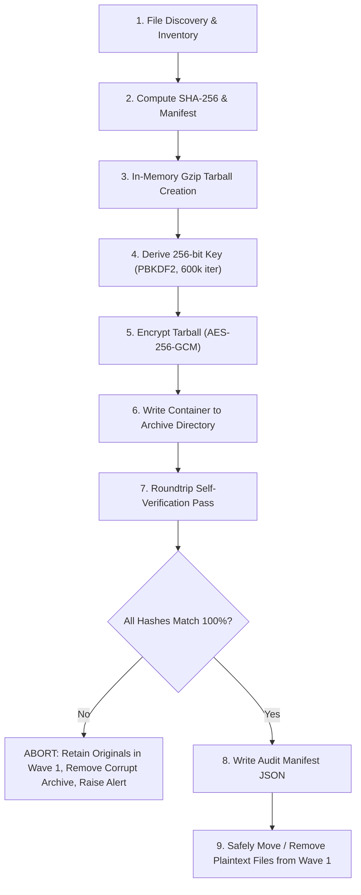

# Encryption-Compression-Archiving Protocol

## Status

This protocol is mandatory for every person, agent, or automation script that archives research data within `research/raw/`. No raw research files may be removed, compressed, or archived without strictly following this procedure.

---

## 1. Purpose

Research raw materials in `research/raw/Stage 1/` (specifically briefs in `Wave 1/`) represent completed, foundational inputs that have already been extracted into structured format in `Stage 2/`. 

To maintain repository cleanliness, minimize storage footprint, and protect raw intellectual artifacts at rest:
- Research brief files from `Stage 1/Wave 1/` are archived into `Stage 1/Archive/`.
- All archived bundles must be compressed to reduce storage overhead.
- All archives must be encrypted with industry-standard authenticated encryption to guarantee privacy and tamper-proofing.
- The original raw files may **only** be moved/removed after an automated roundtrip integrity verification successfully decodes and matches 100% of SHA-256 hashes against the originals.
- A standardized companion restore utility must be available to unpack and verify the archives at any point in the future.

---

## 2. Non-Negotiable Rules

1. **Lossless Preservation:** Compression must be byte-for-byte lossless. Tables, unicode symbols, citation links, and white spaces must be restored identically upon unpacking.
2. **Zero-Trust Deletion:** Original files must **never** be deleted or moved based on an exit code alone. An in-memory decryption, decompression, and SHA-256 checksum comparison against every original source file must pass before any file is removed from `Wave 1/`.
3. **Authenticated Cryptography:** Encryption must use an authenticated cipher (AES-256-GCM). Unauthenticated ciphers (e.g. standard CBC without HMAC, or legacy ZipCrypto) are strictly forbidden.
4. **Strong Key Derivation:** Keys must be derived using PBKDF2-HMAC-SHA256 with at least 600,000 iterations and a cryptographically secure, randomly generated 16-byte salt per archive. Hardcoded keys or static salts are forbidden.
5. **Reproducible Manifest:** Every archive operation must produce an accompanying unencrypted JSON manifest (`<archive_name>_manifest.json`) in the destination directory detailing file names, relative paths, byte sizes, and pre-compression SHA-256 hashes.
6. **Immutable Provenance:** Archiving operations must be logged with execution timestamp, file count, total uncompressed size, and resulting archive hash.

---

## 3. Cryptographic & Container Specification

### 3.1 Algorithms and Parameters

| Component | Standard / Value | Rationale |
| --- | --- | --- |
| **Compression** | `tar.gz` (gzip, level 9) | Universally supported lossless archive container |
| **Cipher** | AES-256 in Galois/Counter Mode (GCM) | Authenticated encryption with associated data (AEAD); detects tampering |
| **Key Derivation** | PBKDF2-HMAC-SHA256 | High iteration work factor resilient against brute force |
| **PBKDF2 Iterations** | 600,000 | Exceeds OWASP 2024 minimum recommendations (210,000+) |
| **Salt Size** | 16 bytes (128 bits) | Cryptographically secure random (`os.urandom`) per archive |
| **Nonce / IV Size** | 12 bytes (96 bits) | Cryptographically secure random (`os.urandom`) per archive |
| **Auth Tag Size** | 16 bytes (128 bits) | Standard GCM tag verifying authenticity and integrity |
| **Magic Header** | `b"ECA1"` (4 bytes) | Identifies "Encryption-Compression-Archive v1" format |

### 3.2 Binary Container Layout

The resulting archive file (`.tar.gz.enc`) uses the following binary structure:

```text
+-------------------+--------------------+--------------------+--------------------+-------------------------------+
| Magic (4 bytes)   | Salt (16 bytes)    | Nonce (12 bytes)   | Auth Tag (16 bytes)| Ciphertext (variable length)  |
| b"ECA1"           | PBKDF2 Salt        | AES-GCM Nonce      | GCM Tag            | Encrypted tar.gz payload      |
+-------------------+--------------------+--------------------+--------------------+-------------------------------+
0                   4                    20                   32                   48
```

Any alteration to the magic bytes, salt, nonce, tag, or ciphertext causes immediate decryption failure before data is extracted or written to disk.

---

## 4. Archiving Workflow — Step by Step



### Step 1: File Discovery & Inventory
- Locate all markdown files in the source directory (`research/raw/Stage 1/Wave 1`).
- Abort immediately if the directory contains zero files or unreadable entries.

### Step 2: Compute SHA-256 & Build Manifest
- Read each file and compute its SHA-256 checksum.
- Record relative path, file size in bytes, and modification timestamp.

### Step 3: In-Memory Compression
- Assemble files into a POSIX-compliant `tar` archive and compress with `gzip` (level 9) directly in memory to prevent intermediate unencrypted temporary files on disk.

### Step 4: Key Derivation
- Acquire passphrase via `ARCHIVE_PASSPHRASE` environment variable or secure interactive console prompt.
- Generate a 16-byte random salt.
- Derive a 32-byte (256-bit) encryption key using PBKDF2 with SHA-256 and 600,000 iterations.

### Step 5: AES-256-GCM Encryption
- Generate a 12-byte random IV/nonce.
- Encrypt the gzip tarball in Galois/Counter Mode.
- Extract the 16-byte authentication tag.

### Step 6: Atomic Container Emission
- Assemble the header (`b"ECA1"` + Salt + Nonce + Tag) and append ciphertext.
- Write to `research/raw/Stage 1/Archive/wave_1_archive_<timestamp>.tar.gz.enc`.

### Step 7: Automated Roundtrip Self-Verification
- Before modifying or removing a single file from the source directory, read the written archive file from disk.
- Decrypt using the same derived key, authenticate with GCM tag.
- Decompress the tarball in memory.
- Compute SHA-256 of every file extracted from the archive.
- Compare each extracted file hash against the pre-archive inventory.
- If any discrepancy, missing file, or tag failure occurs, immediately delete the archive and exit with an error.

### Step 8: Emit Manifest & Audit Log
- Write `research/raw/Stage 1/Archive/wave_1_archive_<timestamp>_manifest.json` containing:
  - Archive creation timestamp
  - Source directory
  - File list with names, relative paths, byte sizes, and original SHA-256 hashes
  - Total compressed size vs uncompressed size (compression ratio)
  - Verification status (`VERIFIED_OK`)

### Step 9: Source Cleanup
- Safely remove the verified original files from `research/raw/Stage 1/Wave 1`.
- Leave `Wave 1/` present as a clean, ready directory.

---

## 5. Restoration Workflow

Restoration is performed via the companion script `scripts/restore_archive.py`.

### 5.1 Listing Contents Without Extraction
```powershell
.venv\Scripts\python scripts/restore_archive.py `
  --archive "research/raw/Stage 1/Archive/wave_1_archive_<timestamp>.tar.gz.enc" `
  --list
```

### 5.2 Full Restoration
```powershell
.venv\Scripts\python scripts/restore_archive.py `
  --archive "research/raw/Stage 1/Archive/wave_1_archive_<timestamp>.tar.gz.enc" `
  --dest "research/raw/Stage 1/Wave 1"
```

The restore script:
1. Validates magic bytes (`b"ECA1"`).
2. Derives the key using the embedded salt and supplied passphrase.
3. Authenticates and decrypts the ciphertext using AES-256-GCM.
4. Decompresses the tarball.
5. Recomputes SHA-256 hashes and compares against the manifest embedded in the archive.
6. Writes files to the target destination.

---

## 6. Key & Passphrase Management

1. **Automation:** The environment variable `ARCHIVE_PASSPHRASE` can be supplied to scripts running in automated workflows.
2. **Interactive:** When `ARCHIVE_PASSPHRASE` is not set, scripts prompt the operator securely (with hidden input and confirmation).
3. **Secrets Hygiene:** Never commit passphrases, `.key` files, or decrypted secrets to git.

---

## 7. Error Handling & Recovery

| Failure Mode | Behavior | Recovery Action |
| --- | --- | --- |
| Wrong Passphrase during verify | Archive rejected; source files untouched | User prompted to re-enter passphrase |
| Checksum mismatch during verify | Archive deleted; source files untouched | Diagnostic alert emitted; inspect disk/memory |
| Archive file corrupted on disk | Restore utility aborts with `AuthenticationError` | Use manifest to identify damage; restore from backup |
| Tampered ciphertext | GCM tag verification fails immediately | Data is not decompressed; tamper alert logged |
