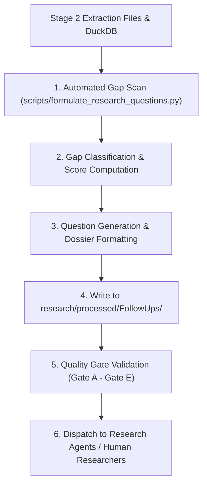

# Follow-Up Research Protocol

## Status

This protocol is mandatory for every researcher, agent, or automation script that formulates, prioritizes, and dispatches follow-up research questions within this workspace. It governs the transition from the structured extraction layer (`research/raw/Stage 2/`) and the intelligence database (`data/citations.duckdb`) into the processed follow-up research agenda (`research/processed/FollowUps/`).

---

## 1. Purpose

The Stage 2 extraction layer isolates established facts, measurable metrics, canonical entities, predicates, and source classifications. In doing so, it explicitly records extraction limitations, missing falsifiers, unstated boundaries, uncorroborated benchmarks, and unresolved open questions in `ExtractionLog.md`. Concurrently, `data/citations.duckdb` detects claims without primary sources, low-confidence assertions, and unresolved aliases via the `next_research_candidates` view.

The purpose of this protocol is to:
- Convert passive gap logs and database warning signals into active, structured, and prioritized research questions.
- Prevent epistemically weak claims or unverified secondary sources from entering downstream modeling as established facts.
- Enforce strict question-scoping and falsification standards adhering to `Protocols/Research-Evaluation.md` (Gate A and Gate E).
- Provide an automated, repeatable mechanism to formulate research questions into `research/processed/FollowUps/`.
- Close the iterative loop:
  $$\text{Research} \rightarrow \text{Extraction} \rightarrow \text{Structured Layer} \rightarrow \text{Database} \rightarrow \text{Gap Detection} \rightarrow \text{Follow-Up Formulation} \rightarrow \text{New Research}$$

---

## 2. Non-Negotiable Rules

1. **Every question must be falsifiable:** A follow-up research question cannot simply ask "what is X?". It must specify what observable evidence, documentation, or benchmark result would confirm, modify, or falsify the target claim or boundary.
2. **Every question must define explicit scope:** In compliance with `Protocols/Research-Evaluation.md` Gate A, each question must specify included entities, excluded adjacent concepts, relevant time period, and intended downstream use.
3. **No untraced questions:** Every formulated question must trace to at least one specific trigger in Stage 2 (`ExtractionLog.md`, `Entities.md`, `Claims.md`, `Metrics.md`) or `citations.duckdb`.
4. **Target evidence class must be explicit:** The question must specify the minimum acceptable evidence class (e.g. primary documentation, formal specification, peer-reviewed paper, independent benchmark) required to close the gap.
5. **Deterministic prioritization:** Follow-up questions must be ranked using the objective multi-factor risk scoring formula. Questions affecting core pipeline stages with high uncertainty take precedence.
6. **Standardized output location:** All formulated research questions, research dossiers, and wave agendas must be placed under `research/processed/FollowUps/`.

---

## 3. Gap Typology & Trigger Sources

The formulation engine identifies six distinct classes of research gaps across Stage 2 and the citation database:

| Gap Code | Typology | Trigger Source | Condition | Formulation Focus |
| --- | --- | --- | --- | --- |
| **`GAP-BND`** | Entity Boundary Gap | `Entities.md` | Boundary column is `[boundary not stated in source]` | Negative definition: what the entity is *not*, disambiguation from adjacent tools/roles |
| **`GAP-CND`** | Metric Condition Gap | `Metrics.md` | Scope/conditions column is `[conditions not stated in source]` | Measurement parameters: hardware, dataset scale, software version, reproduction steps |
| **`GAP-EPI`** | Epistemic Evidence Gap | `Claims.md` & DuckDB `next_research_candidates` | Confidence is `low`, or mapped primary sources = 0 | Direct primary evidence to substantiate, bound, or refute the atomic claim |
| **`GAP-FAL`** | Falsification Gap | `Claims.md` | Falsifier column is `[falsifier not stated]` | Specific observable condition or failure mode that would disprove the claim |
| **`GAP-OPN`** | Carried Open Question | `ExtractionLog.md` | Decision type is `open_question` or `omission` | Resolution of unresolved trade-offs or omitted architectural aspects |
| **`GAP-CON`** | Classification Conflict | `ExtractionLog.md` & `citations.duckdb` | Decision type is `classification_conflict` or unresolved alias | Independent authority check to resolve source credibility and tier |

---

## 4. Prioritization Scoring Algorithm

Each identified gap is assigned an objective **Priority Score** ($S$) calculated as:

$$S = \frac{C_{\text{workflow}} \times E_{\text{severity}}}{D_{\text{difficulty}}}$$

### 4.1 Scoring Dimensions

#### Workflow Centrality ($C_{\text{workflow}}$, range: 1 to 5)
How critical is the affected concept to downstream data modeling, extraction, and pipeline operations?
- **5 (Critical):** Core storage, execution engine, or fundamental data model (e.g. DuckDB vs. Arrow/Polars engine choice, database schema, provenance model).
- **4 (High):** Major workflow stage or primary orchestration framework (e.g. agent framework boundaries, citation ingestion pipeline).
- **3 (Medium):** Specialized analytical capability or secondary tool (e.g. visualization tools, BI layers).
- **2 (Low):** Auxiliary utility or exploratory role (e.g. scraping helper, prompt formatting).
- **1 (Peripheral):** Contextual or historical notes.

#### Evidence Severity ($E_{\text{severity}}$, range: 1 to 5)
How severe is the epistemic gap or risk of misleading conclusions?
- **5 (Severe):** Uncorroborated vendor claim or metric presented without conditions; conflicting classifications on core facts.
- **4 (High):** Material claim relying exclusively on secondary or marketing sources; completely undefined entity boundary for a core tool.
- **3 (Medium):** Low-confidence claim with some supporting secondary evidence; missing falsifier on a non-critical claim.
- **2 (Low):** Incomplete metadata, missing publication date, or minor omitted detail.
- **1 (Negligible):** Stylistic or formatting ambiguity already handled by fallbacks.

#### Verification Difficulty ($D_{\text{difficulty}}$, range: 1 to 3)
How tractable is acquiring the primary evidence? (Higher difficulty scales down urgency to favor actionable wins).
- **1 (Direct/Accessible):** Readily available in official specifications, documentation, or public open-source repositories.
- **2 (Moderate):** Requires comparative benchmarking, reviewing multiple API specs, or analyzing conflicting release notes.
- **3 (Complex/Opaque):** Requires proprietary access, internal industry data, longitudinal surveys, or custom empirical experiments.

### 4.2 Priority Tiers
- **P1 (Score $\ge 12.0$):** Immediate priority. Must be answered before next major schema or pipeline iteration.
- **P2 (Score $6.0 - 11.9$):** Secondary priority. Scheduled into regular research waves.
- **P3 (Score $< 6.0$):** Informational / backlog. Addressed as opportunistic investigations.

---

## 5. Question Formulation Standards

Each formulated research question dossier must follow this structured specification:

```markdown
### [RQ-###] [Concise Question Title]

- **Priority:** P1 / P2 / P3 (Score: X.X)
- **Gap Code:** GAP-BND | GAP-CND | GAP-EPI | GAP-FAL | GAP-OPN | GAP-CON
- **Target Entity / Concept:** [Entity or Claim ID]
- **Downstream Impact:** [Affected workflow stage, table, or schema column]

#### 1. Core Research Question
[Precise, specific question statement]

#### 2. Scope & Boundaries
- **In Scope:** [Entities, versions, environments, workflow stages included]
- **Out of Scope:** [Excluded tools, speculative claims, out-of-context uses]
- **Intended Use:** [How the answer will be applied in Stage 2 / citations database]

#### 3. Target Evidence & Sources
- **Minimum Evidence Class:** Primary / Peer-Reviewed / Official Spec
- **Target Sources:** [Specific docs, GitHub repos, benchmark suites to consult]

#### 4. Falsification & Resolution Criteria
- **Resolution:** [What finding establishes the answer]
- **Falsifier:** [What evidence would invalidate the existing claim or boundary]
```

---

## 6. Execution Procedure



### Step 1: Automated Gap Scan
Run the formulation tool:
```powershell
.venv\Scripts\python scripts/formulate_research_questions.py `
  --stage2-dir "research/raw/Stage 2" `
  --database "data/citations.duckdb" `
  --output-dir "research/processed/FollowUps"
```

### Step 2: Quality Gates Before Acceptance
A formulated research agenda in `research/processed/FollowUps/` is complete only when:
1. **Gate A (Scope Check):** Every question has explicit In Scope, Out of Scope, and Intended Use fields.
2. **Gate B (Falsifier Check):** No question is accepted with an empty or non-testable falsifier.
3. **Gate C (Provenance Check):** Every question references its originating Stage 2 entity ID, claim ID, or log ID.
4. **Gate D (Score Coverage):** Every question has an audited workflow centrality, severity, and difficulty score.

---

## 7. Deliverable Layout in `research/processed/FollowUps/`

The generation process produces:
1. **`ResearchAgenda.md`**: Master index of all formulated questions, ranked by Priority Score, grouped into thematic investigation waves.
2. **Thematic Question Packs**:
   - `Wave2_Entity_Boundaries.md`: Resolves undefined boundaries (`GAP-BND`) for core tools (DuckDB, MotherDuck, Polars, LangGraph, etc.).
   - `Wave2_Benchmark_Conditions.md`: Resolves missing test environments and parameters (`GAP-CND`).
   - `Wave2_Primary_Evidence_Gaps.md`: Resolves claims lacking primary documentation (`GAP-EPI`).
   - `Wave2_Architectural_Open_Questions.md`: Resolves open trade-offs from `ExtractionLog.md` (`GAP-OPN`).
